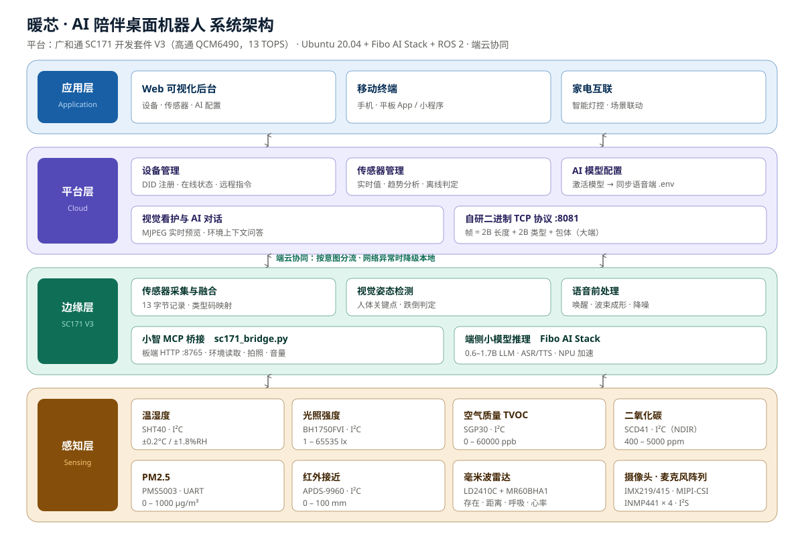

# ⚡ 基于广和通 SC171V3 平台的 AI 陪伴桌面机器人与端云协同优化

> 赛事：2026 年（第十三届）全国大学生物联网设计竞赛 · 广和通赛道 · 高职赛道
> 奖项：一等奖
> 年份：2026
> 平台：广和通 SC171 开发套件 V3（高通 QCM6490，13 TOPS）
> 学校：广西信息职业技术学院
> 团队：队长 李浩然 · 队员 赖春艳、蒋官威威
> 指导老师：曾辉、王卓宇

## 📖 作品简介

本作品基于 SC171 边缘 AIoT 平台研发的 AI 陪伴桌面机器人，面向家庭与办公场景提供多模态智能交互服务。系统融合大语言模型、机器视觉、语音交互与环境感知技术，搭载高清摄像头、麦克风阵列、温湿度/光照/空气质量传感器、红外接近传感器及毫米波雷达等传感器，通过自研物联网平台，实现与移动终端（手机、平板）及家电设备的无缝互联，支持环境监测、室内环境质量分析、智能提醒及姿态检测等功能。

## 🧠 核心功能

- **端云协同优化**：端侧用 Fibo AI Stack 在 NPU 上跑轻量 LLM（0.6–1.7B），承担唤醒、意图识别、Function Calling 与简单问答，本地闭环不出网；复杂对话、长期记忆与知识问答按需上云。按意图与网络状态动态分流，兼顾时延与效果，详见 [`docs/端云协同方案.md`](docs/端云协同方案.md)。
- **多模态智能交互**：语音唤醒 + 大模型对话（小智 xiaozhi 生态），对话时自动注入板端实时传感器与摄像头状态作为上下文，回答贴合当前环境。
- **环境监测与室内空气质量分析**：温度、湿度、光照、TVOC、CO₂、PM2.5 实时上报，边缘侧做趋势分析与阈值判定（干燥 / 闷热 / 空气浑浊 / 光照不足）。
- **视觉看护与姿态检测**：MIPI 高清摄像头多档分辨率实时预览（MJPEG 推流），边缘侧运行人体姿态识别，支持抓拍与画面留存。
- **毫米波非接触式感知**：24GHz / 60GHz 毫米波雷达检测人体存在、目标距离、呼吸频率与心率，无隐私顾虑。
- **自研物联网平台与设备互联**：RuoYi-Vue 管理后台 + 自研二进制 TCP 设备协议（端口 8081），统一管理设备在线状态、远程下发 RGB PWM（智能灯控），并向手机 / 平板 / 家电提供互联接口。
- **智能提醒与安全事件**：结合环境质量与人体感知，触发久坐提醒、跌倒/异常姿态告警、空气质量提醒。

## 🏗️ 系统架构



系统自下而上分四层：

| 层级 | 内容 |
| --- | --- |
| 感知层 | 温湿度 / 光照 / TVOC / CO₂ / PM2.5 / 红外接近 / 毫米波雷达 / 高清摄像头 / 麦克风阵列 |
| 边缘计算层（SC171 V3） | 传感器采集与融合、视觉姿态检测、语音前处理、端侧小模型推理；经自研二进制 TCP 协议（:8081）上报，与云端形成端云协同 |
| 平台层 | RuoYi-Vue 自研物联网平台：设备管理、传感器管理、AI 模型配置、视觉看护、AI 对话 |
| 应用层 | Web 后台可视化 + 移动终端（手机 / 平板）+ 家电互联（智能灯控等） |

## 🔩 硬件清单

完整物料清单见 [`hardware/bom.csv`](hardware/bom.csv)，选型理由与协议码对应关系见 [`docs/传感器选型说明.md`](docs/传感器选型说明.md)。

| 类别 | 型号 | 接口 |
| --- | --- | --- |
| 主控 / 边缘计算 | 广和通 SC171 开发套件 V3（QCM6490，13 TOPS） | — |
| 温湿度 | Sensirion SHT40 | I²C |
| 光照 | BH1750FVI | I²C |
| 空气质量 TVOC | Sensirion SGP30 | I²C |
| 二氧化碳 | Sensirion SCD41（真 NDIR） | I²C |
| PM2.5 | Plantower PMS5003 | UART |
| 红外接近 | Broadcom APDS-9960 | I²C |
| 毫米波雷达（存在 / 距离） | 海凌科 LD2410C（24GHz） | UART |
| 毫米波雷达（呼吸 / 心率） | Seeed MR60BHA1（60GHz） | UART |
| 高清摄像头 | IMX219 / IMX415（MIPI-CSI） | MIPI-CSI |
| 麦克风阵列 | INMP441 × 4（I²S） | I²S |
| 光敏电阻 | GL5528 + 10kΩ 分压 | ADC |

## 📂 目录结构

```text
├── README.md               # 项目说明文件
├── docs/                   # 项目文档、设计报告、参考资料
│   ├── images/             # 架构图与实物图
│   ├── 端云协同方案.md       # 端侧 / 云侧功能划分与分流策略
│   ├── 传感器选型说明.md     # 传感器选型理由与协议码映射
│   └── 目录映射与迁移方案.md  # 既有工程 → 本模板的迁移对照
├── hardware/               # 硬件设计资料
│   ├── pcb/                # PCB工程文件
│   ├── mechanical/         # 结构3D模型
│   └── bom.csv             # 物料清单
├── firmware/               # 设备底层固件源码（板端 lower_python 传感器/摄像头采集）
├── edge_computing/         # 边缘计算与智能算法
│   ├── algorithm/          # 业务算法代码（姿态检测、环境质量分析、传感器融合）
│   ├── ai_model/           # 模型训练与部署文件
│   └── requirements.txt    # 环境依赖
├── cloud/                  # 云端平台服务
│   ├── iot_platform/       # 自研物联网平台后端（RuoYi-Vue 3.9.2 + Netty 二进制 TCP 协议，JDK 17）
│   │   ├── ruoyi-admin/    #   启动入口 + 自研业务（netty.tcp / device / aiModel / companion）
│   │   ├── ruoyi-*/        #   RuoYi 框架模块（common / framework / system / quartz / generator）
│   │   └── sql/            #   建库脚本（导入顺序见该目录 README）
│   └── web_frontend/       # 可视化管理前端（Vue 2 + Element UI，开发端口 8088）
└── tools/                  # 辅助工具与调试脚本
```

## 🚀 快速开始

```bash
git clone https://github.com/你的账号/仓库名.git
cd 仓库名

# 1) 导入数据库（顺序不可颠倒，详见 cloud/iot_platform/README.md）
mysql -uroot -p -e "CREATE DATABASE iot_platform DEFAULT CHARSET utf8mb4;"
mysql -uroot -p iot_platform < cloud/iot_platform/sql/iot_platform.sql
mysql -uroot -p iot_platform < cloud/iot_platform/sql/ai_model_config.sql
mysql -uroot -p iot_platform < cloud/iot_platform/sql/ai_menu_move_out_of_tool.sql

# 2) 启动后端（前置：JDK 17+ / Maven / MySQL / Redis）
cd cloud/iot_platform
mvn clean package -DskipTests
java -jar ruoyi-admin/target/ruoyi-admin.jar

# 3) 启动前端（前置：Node 16+，另开一个终端）
cd cloud/web_frontend
npm install && npm run dev

# 4) 板端采集固件（在 SC171 开发板上运行）
python firmware/main.py
```

访问地址与默认账号：

| 服务 | 地址 |
| --- | --- |
| 管理后台前端 | http://127.0.0.1:8088/index |
| 后端接口 | http://127.0.0.1:8080 |
| 设备 TCP 接入 | 127.0.0.1:8081 |
| 小智客户端（MCP） | http://localhost:9999 |
| 智控台 | http://localhost:8002 |

默认账号：`admin / admin123`

## 📌 备注

- 本模板参考 [Fiborn/FiBoom-project](https://github.com/Fiborn/FiBoom-project) 作品模板组织。
- 赛事：2026 年（第十三届）全国大学生物联网设计竞赛（全国高等学校计算机教育研究会主办）· 广和通赛道 · 高职赛道。
- 平台为**广和通 SC171 开发套件 V3**：8 核 ARM v8（最高 2.7GHz）、13 TOPS 综合算力、出厂 Ubuntu 20.04 + Python 3.8 + ROS 2 + Fibo AI Stack；外设含 USB / UART / RS232 / RS485 / CAN / LAN / HDMI / GPIO / ADC / PWM / 音频 / SD 卡座。
- 团队配置：指导教师 2 人、参赛学生 4 人，均为广西信息职业技术学院在校生。
- 语音交互基于开源**小智（xiaozhi）**生态（MCP 客户端 + 服务端），以 Docker 镜像方式部署，属第三方组件，未纳入本仓库。
- 云端数据库脚本已修正编码问题，`cloud/iot_platform/sql/iot_platform.sql` 为可直接导入的干净版本。
- 仓库不含任何真实密钥；`application*.yml` 中的默认值均为框架出厂值，生产部署请用环境变量覆盖。
